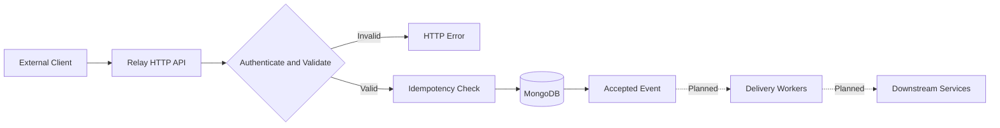

# Relay

**Reliable event ingestion infrastructure built with Go and MongoDB.**

Relay is an open-source project for receiving authenticated HTTP events, validating requests, and persisting accepted events with idempotency protection.

## Features

- HTTP API built with Go
- MongoDB Atlas connectivity
- Bearer API-key authentication
- JSON request validation
- Idempotency-key enforcement
- Event persistence
- Liveness and database readiness endpoints
- Graceful server shutdown

## Architecture



Delivery workers, retries, dead-letter handling, and replay are planned features, not currently implemented functionality.

## Technology Stack

- **Language:** Go
- **Database:** MongoDB Atlas
- **Database driver:** MongoDB Go Driver v2
- **API:** HTTP and JSON
- **Configuration:** Environment variables

## Project Structure

```text
relay/
├── cmd/
│   └── relay/
│       └── main.go
├── internal/
│   ├── config/
│   ├── database/
│   └── handlers/
├── .env.example
├── CONTRIBUTING.md
├── LICENSE
├── go.mod
└── README.md
```

## Getting Started

### Prerequisites

- Go version compatible with `go.mod`
- A MongoDB connection string
- Git

### 1. Clone the repository

```bash
git clone https://github.com/rajputomsingh/relay.git
cd relay
```

### 2. Configure the environment

Copy the example file:

```powershell
Copy-Item .env.example .env
```

Configure `.env` with your local values:

```dotenv
APP_ENV=development
PORT=8080
MONGODB_URI=your_mongodb_connection_string
MONGODB_DATABASE=relay
RELAY_API_KEY=your_secret_api_key
```

Use a strong API key that satisfies the application's configuration requirements. Never commit `.env` or expose credentials.

### 3. Download dependencies

```bash
go mod download
```

### 4. Build and test

```bash
go build ./...
go test ./...
```

### 5. Start Relay

```bash
go run ./cmd/relay
```

## API Endpoints

| Method | Endpoint | Purpose |
|---|---|---|
| GET | `/healthz` | Checks whether the service is running |
| GET | `/readyz` | Checks database readiness |
| POST | `/v1/events` | Accepts an authenticated event |

### Submit an event

`POST /v1/events`

Required headers:

```http
Authorization: Bearer YOUR_RELAY_API_KEY
Content-Type: application/json
Idempotency-Key: unique-event-key-001
```

Example request:

```json
{
  "source": "local-test",
  "event_type": "relay.test",
  "data": {
    "message": "Hello from Relay"
  }
}
```

Example PowerShell request:

```powershell
$headers = @{
    Authorization = "Bearer YOUR_RELAY_API_KEY"
    "Idempotency-Key" = "relay-test-001"
}

$body = @{
    source = "local-test"
    event_type = "relay.test"
    data = @{ message = "Hello from Relay" }
} | ConvertTo-Json -Depth 5

Invoke-RestMethod `
    -Uri "http://localhost:8080/v1/events" `
    -Method Post `
    -Headers $headers `
    -ContentType "application/json" `
    -Body $body
```

Replace the example API key with your configured value.

## Security

- Keep credentials in environment variables or a secrets manager.
- Do not commit `.env` or production secrets.
- Use HTTPS when exposing the API outside a trusted local environment.
- Rotate credentials immediately if they are exposed.
- Do not publish sensitive information in issues or logs.

## Roadmap

- [ ] Expand automated test coverage
- [ ] Concurrent event delivery workers
- [ ] Retry policies and dead-letter handling
- [ ] Event replay
- [ ] Delivery observability and metrics

## Contributing

Contributions and bug reports are welcome. Read [CONTRIBUTING.md](CONTRIBUTING.md) before opening a pull request.

## License

Licensed under the Apache License 2.0. See [LICENSE](LICENSE) for the full license text.
